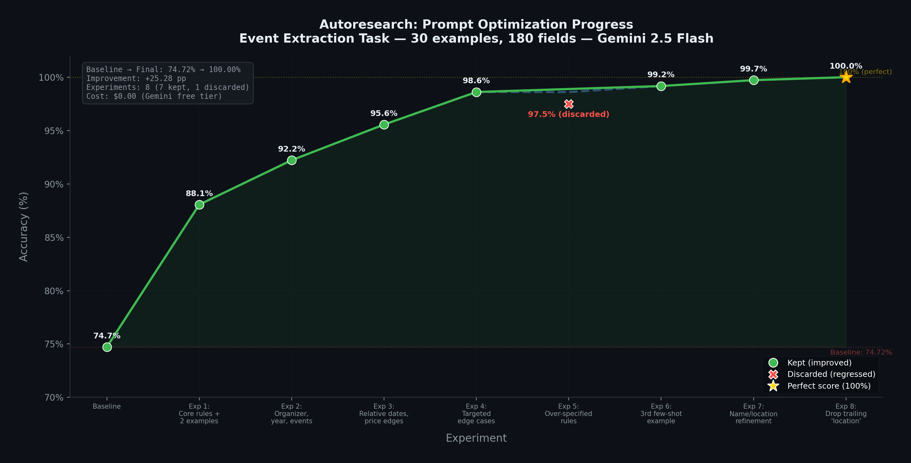

# Autoresearch for Prompt Optimization

Adapting [Karpathy's autoresearch](https://github.com/karpathy/autoresearch) framework to **autonomous prompt engineering**. An AI agent iteratively optimizes a system prompt against a fixed evaluation set, using a git-based experiment loop with automatic keep/discard decisions.

**Result: 74.72% → 100% accuracy in 8 experiments, 0 human interventions.**



## How It Works

The autoresearch loop treats prompt engineering like a research experiment:

1. **Baseline** — Run the current prompt against 30 test examples, score all 180 fields
2. **Analyze failures** — Read per-field results to identify what the model gets wrong
3. **Hypothesize & edit** — Modify `prompt.txt` based on failure patterns
4. **Evaluate** — Run the full eval suite, compare accuracy
5. **Keep or discard** — If accuracy improved, `git commit`. If not, `git reset --hard HEAD~1`
6. **Repeat** — Until a stop condition triggers (max iterations, plateau, or cost limit)

The agent (Claude Opus 4.6) writes prompts for a different model (Gemini 2.5 Flash) — it learns what works by observing the target model's mistakes, not by introspection.

## The Task

**Event information extraction**: given free-form text (emails, social posts, memos, flyers), extract structured JSON with 6 fields: `name`, `date`, `time`, `location`, `price`, `organizer`. Use `null` for missing fields.

The eval set covers 30 diverse inputs: formal invitations, casual texts with slang and emojis, non-English text, canceled events, non-events (lost dog), rumors, multi-tier pricing, flash sales, and more.

## Results

| Experiment | Accuracy | Delta | Status | What Changed |
|-----------|----------|-------|--------|-------------|
| Baseline | 74.72% | — | keep | 4-line minimal prompt |
| Exp 1 | 88.06% | +13.3 | keep | Core rules + 2 few-shot examples |
| Exp 2 | 92.22% | +4.2 | keep | Organizer, year, event classification rules |
| Exp 3 | 95.56% | +3.3 | keep | Relative dates, price edge cases |
| Exp 4 | 98.61% | +3.1 | keep | Targeted name/location/time fixes |
| Exp 5 | 97.50% | -1.1 | **discard** | Over-specified rules — regressed |
| Exp 6 | 99.17% | +0.6 | keep | 3rd few-shot example |
| Exp 7 | 99.72% | +0.6 | keep | Name/location refinement |
| Exp 8 | 100.00% | +0.3 | keep | Final location fix — **perfect** |

## Quick Start

```bash
# Clone
git clone https://github.com/az9713/autoresearch-prompt-optimization.git
cd autoresearch-prompt-optimization

# Install dependencies
pip install -r requirements.txt

# Configure (Gemini free tier recommended)
cp .env.example .env
# Edit .env with your API key

# Run a single evaluation
python evaluate.py

# Run the full autoresearch loop (requires Claude Code)
claude /autoresearch
```

## Project Structure

```
prompt-optimizer/
├── prompt.txt              # The system prompt (only file the agent modifies)
├── eval_set.jsonl           # 30 test examples with ground truth (read-only)
├── evaluate.py              # Evaluation script (read-only)
├── program.md               # Autoresearch loop instructions for the agent
├── resources.md             # Accumulated learnings from experiments
├── .env.example             # Environment config template
├── requirements.txt         # Python dependencies
├── progress.png             # Accuracy progression chart
├── generate_progress.py     # Script to regenerate the chart
├── results.tsv              # Experiment log (generated during runs)
├── AUTORESEARCH_DOCUMENTATION.md  # Deep-dive walkthrough
└── .claude/commands/
    └── autoresearch.md      # Claude Code slash command definition
```

## Documentation

For a detailed walkthrough of every iteration — including the exact prompt at each stage, what changed and why, failure analysis, and key takeaways:

**[AUTORESEARCH_DOCUMENTATION.md](AUTORESEARCH_DOCUMENTATION.md)**

## Key Insights

- **Few-shot examples > rules at high accuracy.** Rules can conflict; examples demonstrate.
- **The discard mechanism is essential.** Iteration 5 regressed — caught instantly, reverted.
- **Diminishing returns are real.** First iteration: +13 points. Last: +0.3 points.
- **Cross-model optimization works.** Claude writes prompts, Gemini executes them.
- **Data-driven beats intuition.** Reading `last_run.json` after each eval turns prompt engineering from art into engineering.

## Acknowledgments

- [Andrej Karpathy](https://github.com/karpathy) for the [autoresearch](https://github.com/karpathy/autoresearch) pattern
- Built with [Claude Code](https://claude.ai/claude-code) (Claude Opus 4.6)
- Evaluated on [Gemini 2.5 Flash](https://ai.google.dev/) (free tier)
